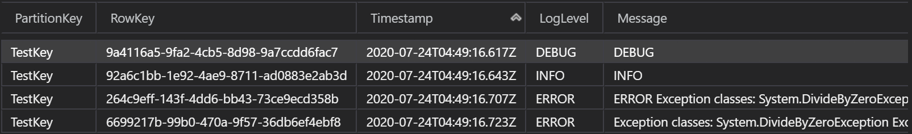

# :page_facing_up: AzureStorageTableCoreLogger

[](https://kiyotakehosomi.visualstudio.com/AzureStorageTableCoreLogger/_build/latest?definitionId=6&branchName=master)  
　  
Implement the interface of Microsoft.Extensions.Logging to output logs to AzureStorageTable.  
（Microsoft.Extensions.Logging のインターフェイスを実装して AzureStorageTable へログを出力します。）  

## Usage:

```csharp
Logger log = new Logger("UseDevelopmentStorage=true", "TestTable", "TestKey");

log.Debug("DEBUG");
log.Info("INFO");
try
{
    int a = 0;
    int b = 0;
    int c = a / b;
}
catch (Exception e)
{
    log.Error(e, "ERROR");
    log.Error(e);
}
```

### Usage results:

  


## Install

:link: [NuGet Gallery | AzureStorageTableCoreLogger](https://www.nuget.org/packages/AzureStorageTableCoreLogger/)


---

## :books: リファレンス

:link: [Logger<T> クラス (Microsoft.Extensions.Logging) | Microsoft Docs](https://docs.microsoft.com/ja-jp/dotnet/api/microsoft.extensions.logging.logger-1?view=dotnet-plat-ext-3.1&viewFallbackFrom=netcore-3.1)  
:link: [Azure Storage Explorer – クラウド ストレージ管理 | Microsoft Azure](https://azure.microsoft.com/ja-jp/features/storage-explorer/)  
:link: [Table Storage | Microsoft Azure](https://azure.microsoft.com/ja-jp/services/storage/tables/)  
:link: [Azure ストレージ エミュレーターを使用した開発とテスト | Microsoft Docs](https://docs.microsoft.com/ja-jp/azure/storage/common/storage-use-emulator)  
